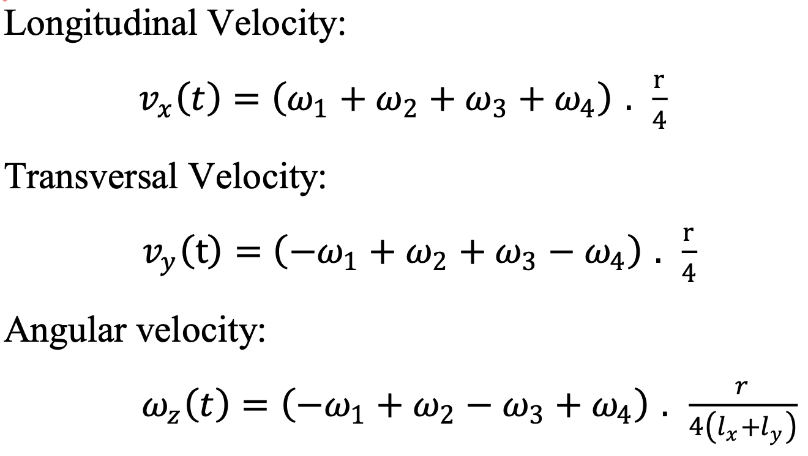

As we describe in our previous tutorial on [building and loading kernel modules on the RB5](https://autonomousvehiclelaboratory.github.io/RB5_Robotics_Tutorials/2022/05/18/2%20Accessing%20Devices/building-and-loading-kernel-modules/), the Ubuntu 18.04 installation that is part of the RB5 LU build includes minimal package support to reduce OS complexity. With this in mind, if we wish to install custom drivers, we need to perform the process described. Thankfully, if you have build and loaded the kernel modules described in our tutorial, you will be able to interface with a standard joystick controller over USB and serial over USB.

With the preliminaries completed, we will use the [Megabot Robot](https://store.makeblock.com/products/makeblock-mbot-mega-robot-kit) as an example to interface with an RB5. In this case, we will use the `megapi` Python module designed for the Megabot to communite with the robot. This can be readily installed using `pip install megapi`.

Here we define a set of primitive actions that can control this four-mechanum-wheel robot. The set of primitive control actions include move `left`,`right`,`forward`, `in reverse`, rotate `clockwise`, `counter-clockwise`, and `stop`. Yes, it come as a surprise to many but the wheels on the robot contain a number of different rollers that ultimately influence the kinematics of the robot and jointly provide very interesting properties such as rotating in place and moving sideways!

The forward and inverse kinematics of the robot can be described by Fig. 1 and Fig. 2, respectively.

 



## ROS1 

Create a workspace, clone the ROS1 implementation, and build the package. Make sure ROS is in your path, i.e. `source /opt/ros/melodic/setup.bash`. 

```
mkdir -p rb5_ws/src && cd rb5_ws/src
git clone https://github.com/AutonomousVehicleLaboratory/rb5_ros.git
cd ..
catkin_make
source rb5_ws/devel/setup.bash 
```

Start the AprilTag detection node

```
ros run april_detection april_detection_node
```


## ROS2

Create a workspace, clone the ROS2 implementation, and build the package. Make sure ROS is in your path, i.e. `source /opt/ros/dashing/setup.bash`. 

```
mkdir -p rb5_ws/src && cd rb5_ws/src
git clone https://github.com/AutonomousVehicleLaboratory/rb5_ros2.git
cd ..
colcon build
source rb5_ws/install/setup.bash 
```

Start the AprilTag detection node

```
ros2 run ros2_april_detection april_detection_node
```


## Visualizing the markers and poses


[](https://youtu.be/qRoW6ljBfFo "AprilTag Detection in ROS") 

<h6 align="center"> AprilTag3 detection and real-time 3D pose estimation running onboard of Qualcomm RB5. To play video, click on image.
</h6> 


### References

